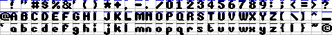

DPTLib > framebuf > bmfont
==========================
"bmfont" is a sub-library of DPTLib for drawing proportional bitmap fonts. It reads font definitions from PNG files which have the glyphs laid out in a grid with extra lines inserted that define the advance widths, like so:



It can handle 4bpp and 32bpp format screens at the time of writing.

It supports both opaque and transparent backgrounds.

Its rendering should be reasonably quick.


PNG format
----------
This PNG should be 32 characters wide. bmfont works out the character dimensions from the total PNG size.

It should be a 4 colour PNG (an 8bpp 4-palette-entry image wouldn't do) where pixels of value 1 are font definitions and pixels of value 2 are advance widths.


DPTLib Screen Setup
-------------------

1. `bitmap_init()` to create a `bitmap_t` for your destination buffer.
2. `screen_for_bitmap()` to create a `screen_t` from the `bitmap_t`.

Setup
-----

`bmfont_create()` to load a font from a PNG, returning a font handle.

Measuring
---------
Use this to measure and determine split points for lengths of text. Units are in pixels.

``` C
result_t bmfont_measure(bmfont_t       *bmfont,
                        const char     *text,
                        int             textlen,
                        bmfont_width_t  target_width,
                        int            *split_point,
                        bmfont_width_t *actual_width);
```

`bmfont_measure()` takes a font handle, a pointer to some text, the number of characters to consider and a target width. It returns a split point, and an actual width (both optional - pass `NULL` if not required).

Drawing
-------
Use this to draw lengths of text.

``` C
result_t bmfont_draw(bmfont_t      *bmfont,
                     screen_t      *scr,
                     const char    *text,
                     int            len,
                     colour_t       fg,
                     colour_t       bg,
                     const point_t *pos,
                     point_t       *end_pos);
```

`bmfont_draw()` takes a font handle, the screen to draw to, a pointer to some text, the number of characters to consider, foreground and background colours, and a start position. It returns an end position (optional - pass `NULL` if not required).

Origin is top left.

Limitations
-----------
* There's no character mapping yet - characters are treated as bytes, not UTF-8.
* There's no tracking or kerning.

